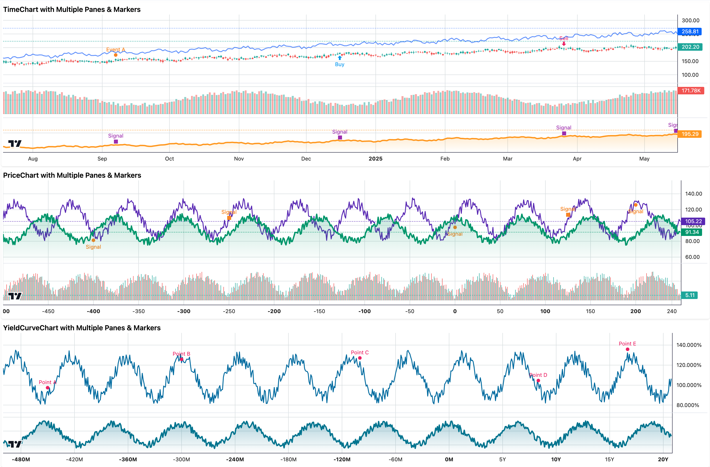

<p>
  
</p>

# @dschz/solid-lightweight-charts

[](LICENSE)
[](https://github.com/tradingview/lightweight-charts)
[](https://www.npmjs.com/package/@dschz/solid-lightweight-charts)
[](https://bundlephobia.com/package/@dschz/solid-lightweight-charts)
[](https://github.com/dsnchz/solid-lightweight-charts/actions/workflows/ci.yaml)

> A fully typed SolidJS wrapper around TradingView's [Lightweight Charts](https://github.com/tradingview/lightweight-charts), providing declarative, reactive charting with support for time series, price, and yield curve data.



## ✨ Features

- ⚡ SolidJS-native reactivity for all chart options
- 🔀 Multiple chart types with specialized APIs:
  - `TimeChart` for time-based financial data
  - `PriceChart` for numeric-based price data
  - `YieldCurveChart` for rate curves and duration-based data
- 📈 Supports all core, built-in chart series types: Line, Area, Candlestick, Bar, Histogram, Baseline
- 📆 Namespaced APIs (e.g. `<TimeChart.Series />`, `<PriceChart.Series />`)
- 📊 Multiple panes support for advanced multi-series visualization (e.g. `<TimeChart.Pane />`, `<PriceChart.Pane />`)
- 🔖 Can still use core `lightweight-chart` APIs (i.e. `createSeriesMarkers`) to tap into advanced features where needed.
- 🧹 Proper lifecycle management and state cleanup

## 🛣️ Roadmap

- [x] Time-based charts (`createChart` via `TimeChart`)
- [x] Price-based charts (`createOptionsChart` via `PriceChart`)
- [x] Yield curve charts (`createYieldCurveChart` via `YieldCurveChart`)
- [x] Series and Pane management
- [x] Series markers
- [ ] Custom Series support

## 📆 Installation

Install via your favorite package manager:

```bash
npm install solid-js lightweight-charts @dschz/solid-lightweight-charts
pnpm install solid-js lightweight-charts @dschz/solid-lightweight-charts
yarn install solid-js lightweight-charts @dschz/solid-lightweight-charts
bun install solid-js lightweight-charts @dschz/solid-lightweight-charts
```

> These are **peer dependencies**, so they must be installed manually:
>
> - `solid-js`
> - `lightweight-charts`

## 🚀 Quick Usage

### TimeChart (Time-based Data)

```tsx
import { TimeChart } from "@dschz/solid-lightweight-charts";

<TimeChart>
  <TimeChart.Series
    type="Line"
    data={[
      { time: "2023-01-01", value: 100 },
      { time: "2023-01-02", value: 105 },
    ]}
    lineWidth={2}
    color="#2962FF"
  />
</TimeChart>;
```

### PriceChart (Numeric X-axis)

```tsx
import { PriceChart } from "@dschz/solid-lightweight-charts";

<PriceChart>
  <PriceChart.Series
    type="Line"
    data={[
      { time: 0, value: 100 },
      { time: 1, value: 105 },
    ]}
    lineWidth={2}
    color="#2962FF"
  />
</PriceChart>;
```

### YieldCurveChart (Duration-based)

```tsx
import { YieldCurveChart } from "@dschz/solid-lightweight-charts";

<YieldCurveChart>
  <YieldCurveChart.Series
    type="Line"
    data={[
      { time: 0, value: 3.5 }, // 0M
      { time: 12, value: 3.8 }, // 12M
      { time: 60, value: 4.2 }, // 5Y
    ]}
    lineWidth={2}
    color="#2962FF"
  />
</YieldCurveChart>;
```

### Multiple Panes and Markers

```tsx
import { TimeChart } from "@dschz/solid-lightweight-charts";
import { createSeriesMarkers, type SeriesMarker, type Time } from "lightweight-charts";

<TimeChart>
  {/* Main pane with price data */}
  <TimeChart.Series
    type="Candlestick"
    data={candleData}
    onSetData={({ series, data }) => {
      // Add markers using the createSeriesMarkers API
      createSeriesMarkers(series, [
        {
          time: data[10].time,
          position: "aboveBar",
          color: "#f68410",
          shape: "circle",
          text: "Buy",
        },
      ] as SeriesMarker<Time>[]);
    }}
  />

  {/* Secondary pane with volume */}
  <TimeChart.Pane>
    <TimeChart.Series type="Histogram" data={volumeData} priceScaleId="volume" />
  </TimeChart.Pane>
</TimeChart>;
```

## 🛠 Playground Example

See [`playground/App.tsx`](./playground/App.tsx) for a complete working showcase using all chart types and series options.

The playground demonstrates:

- TimeChart with multiple panes (Candlestick+Line, Volume, Area) and series markers
- PriceChart with multiple panes (Line+Area, Histogram) and series markers
- YieldCurveChart with multiple panes (Line, Area) and series markers

## 📚 Resources

- [TradingView Lightweight Charts Docs](https://tradingview.github.io/lightweight-charts/)
- [Lightweight Charts GitHub](https://github.com/tradingview/lightweight-charts)

> Full documentation and advanced guides coming soon.

## 📄 License

MIT © [Daniel Sanchez](https://github.com/dsnchz)
